# Apama extension for EPL development in VSCode

A community-developed extension for using VSCode to develop Apama Streaming Analytics applications.

For more information about Apama and EPL please visit the [Apama Community](https://www.cumulocity.com/product/apama-community-edition/) website. To ask questions about Apama or this extension, see the [Apama community forum](https://techcommunity.cumulocity.com/tag/streaming-analytics-apama).

See also the [VSCode extension for PySys testing](https://marketplace.visualstudio.com/items?itemName=ApamaCommunity.pysys-vscode-extension).

## Features of the plugin

* Syntax highlighting
* Error/warn messages and problems
* Adding bundles to an Apama project
* Support for debugging and launching pure single-file and multi-file EPL applications in a correlator

## Getting started

To use all the functionality provided by this extension, you need a full installation of Apama that includes the "dev" tooling (e.g. one that includes `bin/engine_deploy`). If Apama is not installed, basic syntax highlighting is available but most other other features will not work. 

It is strongly recommended to use the _latest_ version of Apama. Support for Apama versions before 10.15.6.1 is not guaranteed (consider reverting to an older version of the extension if you are using an old version). 

The extension can run on Linux. It can also be installed on Windows, either directly (for Apama versions that have a Windows installation package) or using WSL (Windows Subsystem for Linux). 

### Installing on Windows with WSL
If you do not have a Windows installation package or simply prefer to develop on Linux, installing the VS Code [WSL](https://code.visualstudio.com/docs/remote/wsl) extension allows VS Code running on Windows to use a Linux-based Apama installation package. 

See the VS Code documentation for detailed guidance on setting up WSL but the main steps are:

* Install the latest version of [WSL](https://learn.microsoft.com/en-us/windows/wsl/install), using the **Debian** distribution of Linux. This may take some time and often requires a restart. See the Microsoft instructions for full details, but typical steps on a recent version of Windows would be:
  * Open a PowerShell terminal "as Administrator"
  * `wsl --install`
  * `wsl --install -d Debian`
* Once installed, open a WSL terminal (for example by opening `Debian` from the Start Menu) and install Apama using the "dev" package for Linux.
  * For 10.15:
    * Identify the required package from the [download site](https://download.cumulocity.com/Apama/10.15), for example `apama-c8y-dev_10.15.*.*_amd64_linux.tar.gz`
    * Download the package by passing this URL to `wget` (you may need to run `sudo apt install wget` first, if it is not yet installed)
    * Then unpack it to the default directory using: `sudo mkdir -p /opt/cumulocity && sudo tar -xf apama-dev_10.15.*_amd64_linux.tar.gz -C /opt/cumulocity` (hint: you will need to enter the password for the root account you created during WSL setup)
  * For later releases (26.x onwards), install the `dev` (and optionally `apama-python`) Debian packages from the [Apama Repository](https://download.cumulocity.com/Apama/Debian/)
* Open VS Code, and install the [Visual Studio Code Remote Development Extension Pack](https://marketplace.visualstudio.com/items?itemName=ms-vscode-remote.vscode-remote-extensionpack), and the [Apama Extension for VS Code](https://marketplace.visualstudio.com/items?itemName=ApamaCommunity.apama-extensions).
* Using the command palette (`Ctrl+Shift+P`), select `Connect to WSL`
* You can now create a new project, or clone an existing project from your version control system (e.g. Git). For WSL, it is recommended to use a location under your Linux home directory (`~`) to store your Apama projects (this provides faster performance than mounting locations such as `C:\` from the Windows file system; don't worry, the Linux file system can still be accessed from Windows - see the WSL documentation for details)

### Opening your first Apama project

First ensure the Apama Extensions for Visual Studio Code are installed, and that you have an installation of Apama. Where possible, ensure Apama is installed to the default installation directory `/opt/cumulocity/Apama`, so that the location can be detected automatically. If you use a different location, you will need to configure the location of Apama home in the Apama extension's settings, and then reload the VSCode window before proceeding.

If you want to start with an **existing Apama project** you were already working on (or clone of a sample project), simply open the Apama project folder (that is, the directory with the `.project` and `.dependencies` files) in your VS Code workspace. Note that the Apama project files must be in the top level of that folder.

If you want to **create a new project**, make a directory for your project and open it in VS Code. Then open the `Apama Projects` view and click the icon near the top right to `Create Project`. You can now use that view to add any bundles required for your project, for example the Cumulocity bundle, or for Analytics Kit block development a relative path such as `../apama-analytics-builder-block-sdk/bundles/AnalyticsBuilder.bnd`. Then use the main menu to create one or more `.mon` files for your EPL application or block. 

## Limitations

* Completion proposal are not yet available (except for basic snippet and history suggestions).
* No support for multiple folders per workspace - there should be just one folder per workspace, and it should contain an Apama project (i.e. a `.project` and `.dependencies` file at the top level)
* No incremental builds - all EPL files are rebuilt every time there is a change (although there is caching of the parsing phase for files that did not change). This may result in slow error markers (and high CPU utilization) when working on a large project on a low-powered laptop.

## License

Copyright (c) 2020-present Cumulocity GmbH

Licensed under the Apache License, Version 2.0 (the "License");
you may not use this file except in compliance with the License.
You may obtain a copy of the License at

    http://www.apache.org/licenses/LICENSE-2.0

Unless required by applicable law or agreed to in writing, software
distributed under the License is distributed on an "AS IS" BASIS,
WITHOUT WARRANTIES OR CONDITIONS OF ANY KIND, either express or implied.
See the License for the specific language governing permissions and
limitations under the License.

# Features

## EPL Syntax highlighting

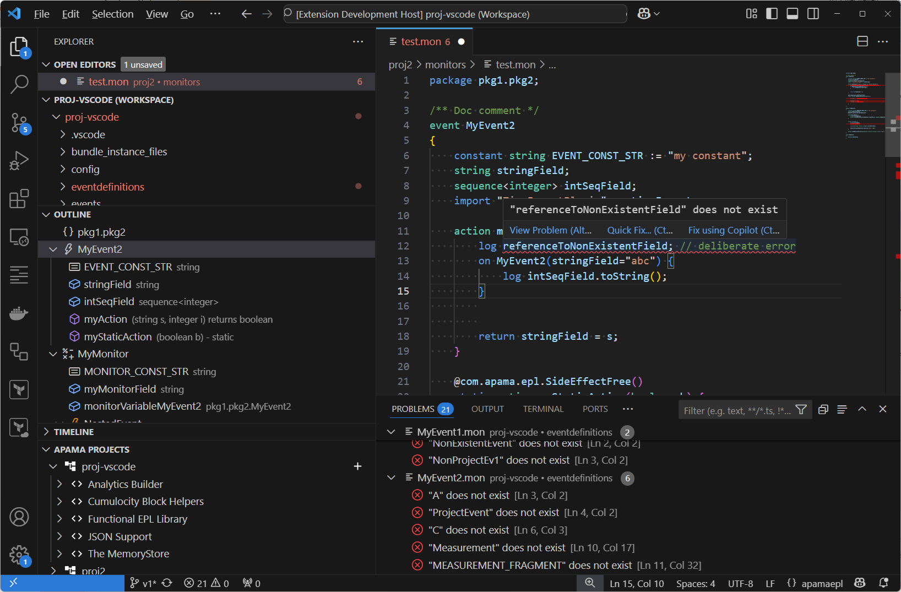

## Settings

There are various settings available for the extension. All the Apama configuration entries are prefixed 'Apama', and searching for 'Apama' will show all of them.

* apamaHome contains the path to the installation directory of the version you wish to use.
* debugHost is the default host for a correlator started for debug (allowing remote instance).
* debugPort is the default port for a correlator started for debug.

## Advanced syntax highlighting and error reporting

This extension supports using a Language Server for advanced syntax highlighting and error reporting for users using Apama 10.15.6.1 and later. 

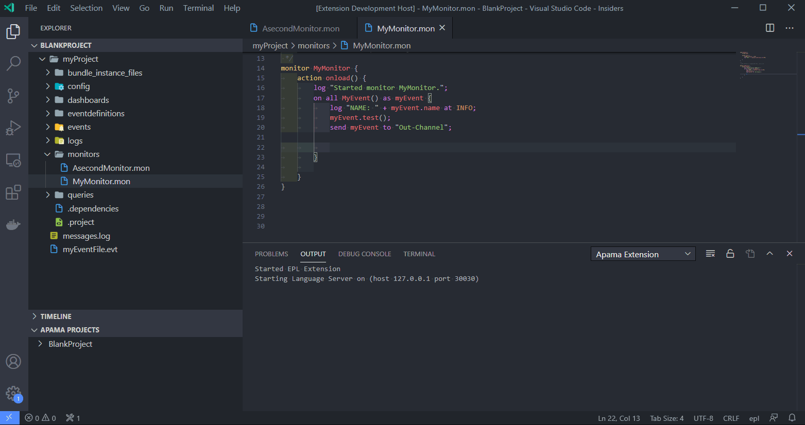

## Snippets

There are various snippets defined in the extension to make writing code easier.

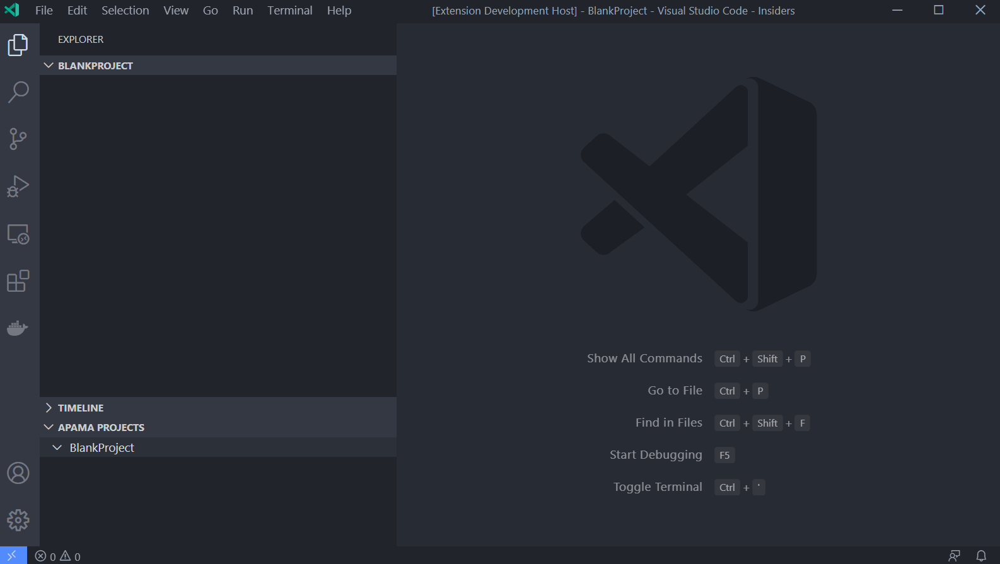

## Tasks: correlator, inject monitor, and send event

Tasks can be created for running correlators on specific ports. The commands to inject EPL and send events also support these ports. Additionally there are tasks for engine_watch and engine_receive that can also be set up.

The animation below shows the default operation of the tasks.

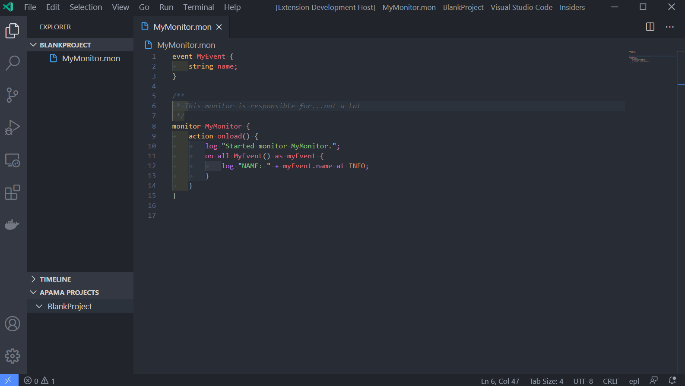

## Send Event file

Once you have a correlator executing some EPL then you can send event files to it with a right-click.

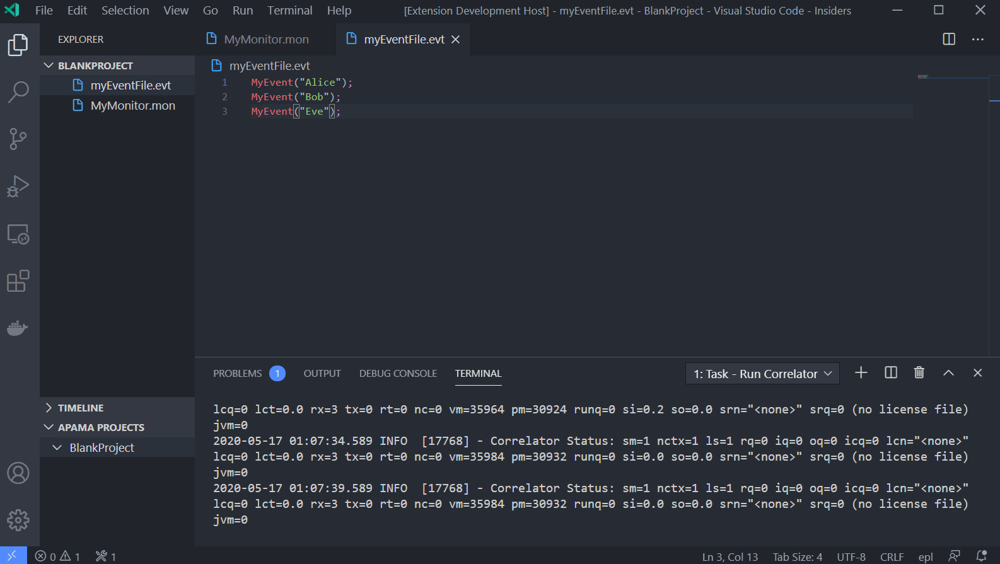

## Create Tasks

The animation below shows how to create a non-default tasks (allowing multiple correlators on different ports for example).

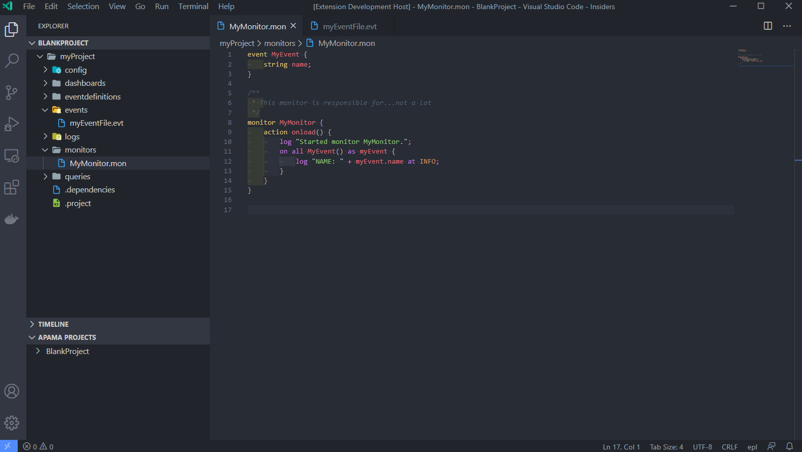

## Create Project

The `apama_project` tool can be used to create projects which are compatible with all of Apama's development tooling.

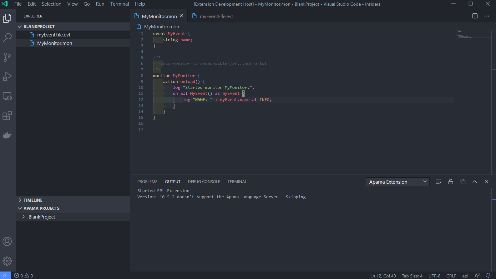

## Add bundles

You can add Bundles and instances to the project using the UI.

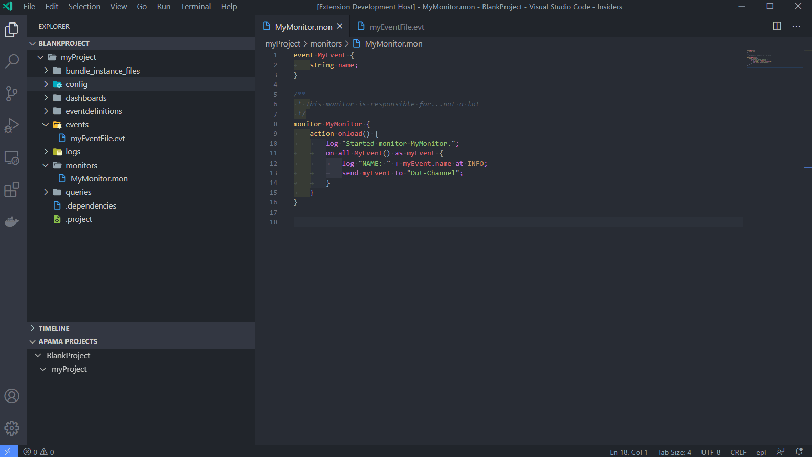

## Remove bundles

You can remove Bundles and instances from the project using the UI.

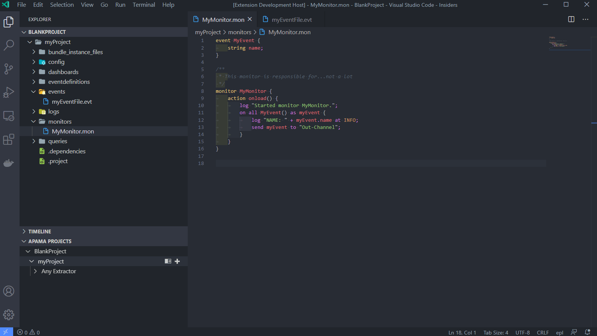

## Deploy project

You can deploy the project using the UI and then run that project in a correlator. N.B. currently you may need to create or move a configuration file into the root of the deployed directory.

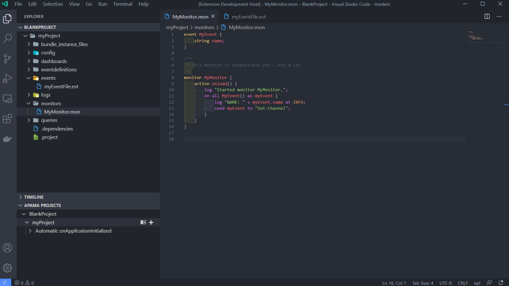

## Add breakpoints

You can add breakpoints to the code for debugging. These are limited to line-based breakpoints currently.

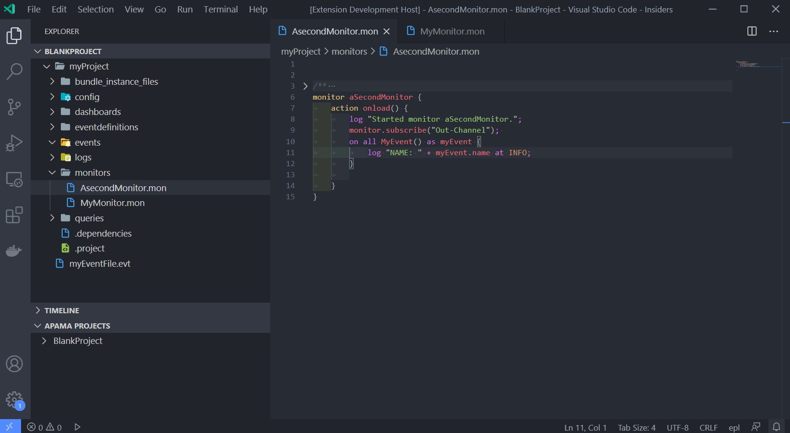

## Debug

Debugging the application also follows the standard vscode patterns.

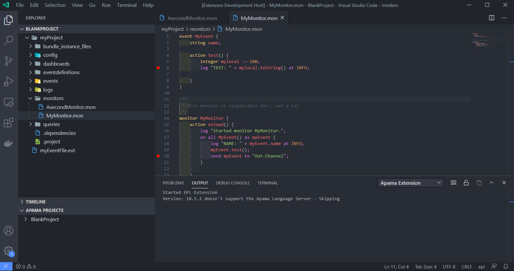
