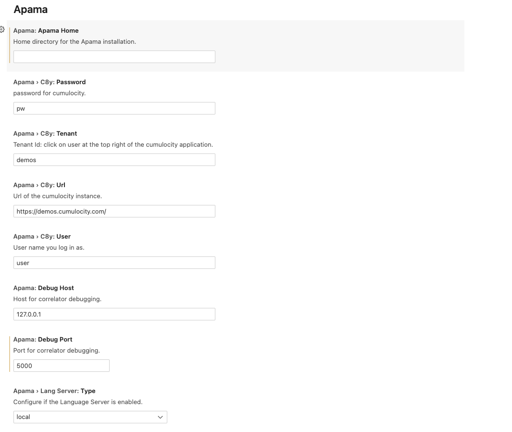

# apama-vscode-extensions

A community developed VSCode extension to support the development of Apama Streaming Analytics applications.

For more information about Apama and EPL please visit the [Apama Community](http://www.apamacommunity.com/) website.

Also available is a [VSCode extension for PySys testing](https://marketplace.visualstudio.com/items?itemName=ApamaCommunity.pysys-vscode-extension) .

## Features of the plugin

* Enables features of the extension for correct matching versions of Apama.
* Supports EPL language diagnostics.
* Support for debugging and launching pure single-file and multi-file EPL applications in a correlator.
* Supports use of the apama_project tool.
* Supports using the Apama Language Server for advanced syntax highlighting and error detection.
* Apama based settings for current and upcoming changes live.

## Requirements
- Syntax highlighting does not require any version of Apama to be installed.
- For EPL lanugage diagnostics, a minimum of version of Apama 10.5.3 is required.
- For Language Server support, a minimum version of Apama 10.15.6.0 is required.

A minimum version of Apama 10.15.6.0 is required for advanced functionality.

## Limitations

* Debug of deployed projects only.
* Diagnostics are limited to EPL files currently (imported packages may not work).
* Completion is currently only snippet and history based.

## EPL Syntax highlighting

## Settings

There are various settings available for the extension now. All the Apama configuration entries are prefixed 'Apama', and searching for 'Apama' will show all of them.

* apamaHome contains the path to the installation directory of the version you wish to use.
* debugHost is the default host for a correlator started for debug (allowing remote instance).
* debugPort is the default port for a correlator started for debug.
* langServer.type is a dropdown that controls the LSP for vscode, it can be local (starts and attaches) or disabled.

## Diagnostics

If you have enabled the Language Server and are using Apama full version 10.5.3+ then you will have access to live diagnostics. These diagnostics are limited to the file currently being edited but will become more fully featured as future releases are produced. Specifically, if you write EPL that uses external bundles or code, then the diagnostics may not take these into account.

## Snippets

There are various snippets defined in the extension to make writing code easier.

## Tasks: correlator, inject monitor, and send event

Tasks can be created for running correlators on specific ports. The commands to inject EPL and send events also support these ports. Additionally there are tasks for engine_watch and engine_recieve that can also be set up. In future releases there will be a more coherent interface for this allowing a suite of tasks to be set up in one operation.

The animation below shows the default operation of the tasks.

## Send Event file

Once you have a correlator executing some EPL then you can send event files to it with a right-click.

## Create Tasks

The animation below shows how to create a non-default tasks (allowing multiple correlators on different ports for example).

## Create Project

The apama_project tool can be used to create projects which are compatible with the eclipse-based IDE, and will also allow you to edit Designer created projects in vscode.

## Add bundles

You can add Bundles and instances to the project using the UI.

## Remove bundles

You can remove Bundles and instances from the project using the UI.

## Deploy project

You can deploy the project using the UI and then run that project in a correlator. N.B. currently you may need to create or move a configuration file into the root of the deployed directory.

## Add breakpoints

You can add breakpoints to the code for debugging. These are limited to line-based breakpoints currently.

## Debug

Debugging the application also follows the standard vscode patterns.

## Release Notes
**Please see https://github.com/ApamaCommunity/apama-vscode-extensions/releases for the latest release notes. The notes below have been kept for historical purposes.**

## v1.2.1

* First release under ApamaCommunity.

## v1.0.1 (June 2020)

* Finished syntax highlighting.
* Documentation.
* Apama EPL diagnostics (via LSP support in eplbuddy tool).
* Integration with apama_project tool.
* Fixed small bug when starting the Language Server.
* Preparation for future support of integration with [EPL Apps](https://cumulocity.com/guides/apama/analytics-introduction/#apama-epl-apps) feature of Cumulocity IoT.

## v0.2.0 to v0.9.0 (February 2020)

* Better syntax highlighting, Snippets, Apama EPL debugging
* Snippets support and further syntax highlighting added
* Cleanup of code and rewrite of the tmLanguage file
* Small readme change and addition of image dir.

## v0.1.0 (February 2020)

* Initial release (started June 2018)
* Basic highlighting with some support for more complex code structures.
* Placeholder for command functionality
